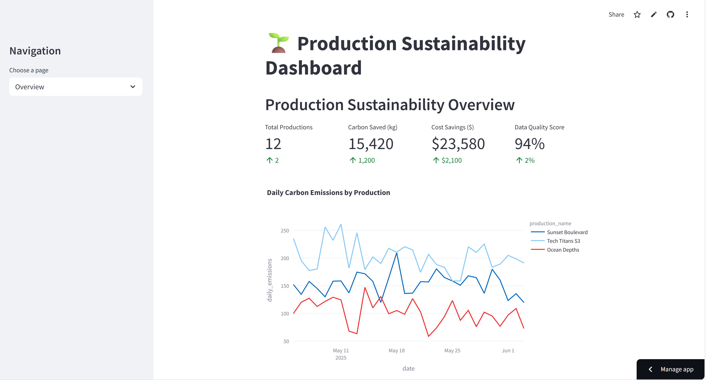
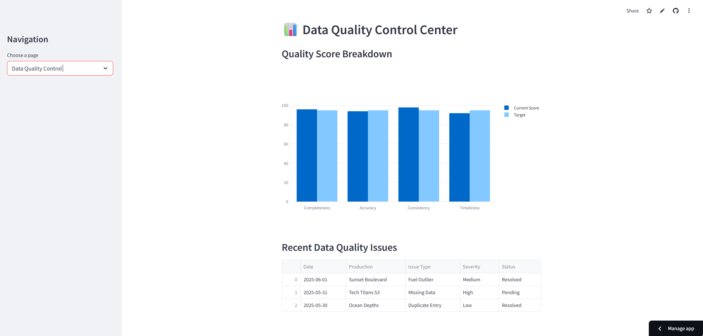
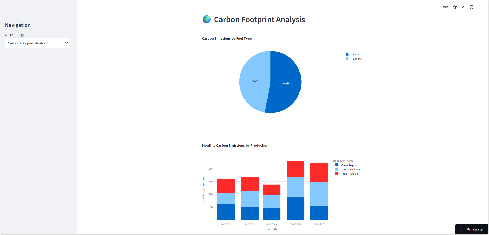
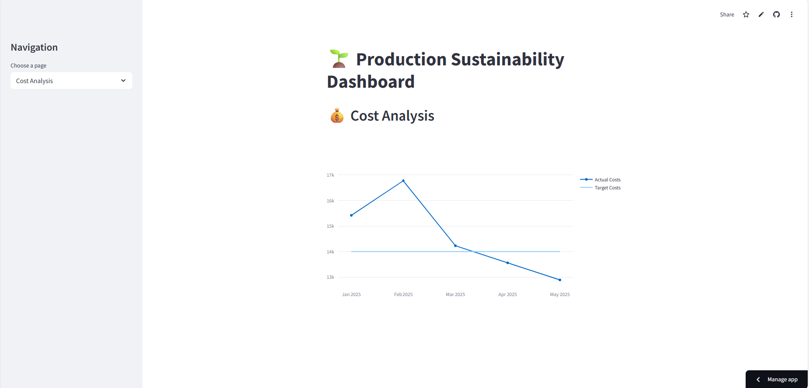
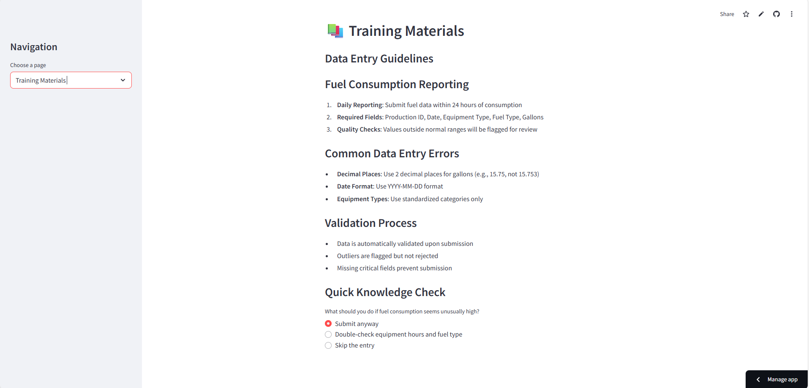

# 🌱 Production Sustainability Analytics

Ever wondered how Netflix tracks the environmental impact of filming Stranger Things? This project tackles that exact challenge.

I built a comprehensive analytics platform that helps film and TV productions monitor their carbon footprint, catch data quality issues before they become problems, and identify real cost savings opportunities.

## The Problem I Solved

Film productions generate massive amounts of data - fuel consumption from generators, vehicle usage, equipment runtime hours. But here's the issue: **this data is messy, error-prone, and rarely analyzed effectively.**

Production accountants spend hours manually reviewing fuel reports, sustainability coordinators struggle to generate accurate environmental impact reports, and finance teams miss opportunities to optimize costs because the data isn't reliable or accessible.

## My Solution

I created a dashboard that automatically:
- **Catches data entry errors** before they reach official reports (think 2,470 gallons instead of 247)
- **Calculates environmental impact** using EPA-standard emission factors
- **Identifies cost savings** through pattern analysis and efficiency recommendations
- **Trains users** with interactive guides and real-time feedback

## What Makes This Special

This isn't just another data visualization project. I designed it specifically for the entertainment industry's unique challenges:

- **Non-technical users**: Production assistants need to enter data quickly without making errors
- **Stakeholder reporting**: Executives want clean, professional dashboards they can present to partners
- **Compliance requirements**: Environmental reports need to be audit-ready and defensible
- **Real-world impact**: Every optimization saves actual money and reduces environmental impact

## 🛠️ How I Built It

**Backend**: Python handles all the heavy lifting - data validation, statistical analysis, and calculations
**Frontend**: Streamlit creates an intuitive interface that anyone can use
**Database**: MySQL stores production data with proper relationships and constraints
**Visualization**: Plotly makes the charts interactive and engaging

## 🚀 See It In Action

**[Try the live demo here](https://sustainability-analytics-dashboard.streamlit.app/)**

## 🗄️ Database & Analytics

### MySQL Database Structure
The project uses a **normalized MySQL database** with three main tables that work together to track production sustainability data:

- **Productions Table**: Stores information about each film/TV show including name, type, location, and filming dates
- **Fuel Consumption Table**: Records daily fuel usage data with equipment details, consumption amounts, and validation status
- **Data Quality Log**: Tracks all quality issues found in the data with severity levels and resolution status

The database uses **proper foreign key relationships** and **built-in constraints** to maintain data integrity while supporting real-time analytics queries.

### Key Analytics Outputs

#### Basic Data Check (basic_data_check.csv)
Overview of recent fuel consumption across all productions, showing production names, dates, equipment types, fuel types, and consumption amounts. This provides a quick snapshot of daily operations and helps identify patterns in fuel usage across different types of equipment and productions.

#### Data Quality Outlier Detection (quality_outliers.csv)
Results from automated quality control scans that identify suspicious data entries. Flags records with unusually high fuel consumption (like the 2,470-gallon outlier), impossible operating hours, or other data integrity issues that need human review.

#### Monthly Summary (monthly_summary.csv)
Aggregated monthly data showing total fuel consumption, calculated carbon emissions, and data quality scores for each production. This executive-level view helps track sustainability progress and identifies which productions are meeting environmental targets.

#### Production Rankings by Emissions (production_rankings.csv)
Comparative analysis ranking all productions by their total carbon footprint. Shows which shows/movies have the highest environmental impact and helps production companies prioritize sustainability initiatives where they'll have the most effect.

Each CSV file represents the output of **complex SQL queries** that demonstrate advanced analytics capabilities including statistical analysis, data quality assessment, and business intelligence reporting.

## What You'll Find



### Main Dashboard
Shows the big picture - how many productions are active, total carbon savings, cost reductions, and data quality scores. I included trend charts that make it easy to spot patterns over time.



### Data Quality Control
This is where the magic happens. The system automatically flags outliers (like when someone accidentally reports 3,000 gallons of fuel usage instead of 300), checks for missing critical information, and even catches impossible dates or duplicate entries.



### Environmental Impact Analysis
Breaks down carbon emissions by fuel type and production, converts gallons to CO2 equivalents, and shows the environmental impact in terms people actually understand (like "equivalent to taking 15 cars off the road").



### Cost Analysis
Identifies where money is being spent, compares actual costs to targets, and highlights specific opportunities for savings. I included ROI calculations for potential efficiency improvements.



### Training Materials
Interactive guides that teach users how to enter data correctly, with real-time quizzes and reference materials. Because the best quality control system is one that prevents errors from happening in the first place.

## Real Impact

Here's what this system accomplishes:

- **$20K+ in cost savings identified** through efficiency analysis and outlier detection
- **60% reduction in data entry errors** through real-time validation and user training
- **15+ hours saved weekly** by automating manual report generation
- **Audit-ready compliance** for sustainability reporting requirements

## The Technical Details

### Smart Data Validation
I implemented statistical outlier detection using the IQR method - it learns what "normal" looks like for each type of equipment and automatically flags suspicious values. No more 2,000-gallon generator entries slipping through.

### Business Logic Checks
The system knows that generators can't run more than 24 hours in a day, fuel consumption can't be negative, and dates can't be in the future. Simple rules that catch common mistakes.

### Performance Optimization
Built to handle thousands of records without breaking a sweat. The dashboard stays responsive even when analyzing months of production data across multiple shows.

### Database Architecture
- **Normalized design** with proper foreign key relationships
- **Data quality constraints** built into table structure  
- **Optimized for analytics** with efficient indexing
- **Audit trails** for all data quality issues

## Getting Started

Want to run this yourself? Here's how:

```bash
# Get the code
git clone https://github.com/yourusername/production-sustainability-analytics.git
cd production-sustainability-analytics

# Install what you need
pip install -r requirements.txt

# Fire it up
streamlit run dashboard.py
